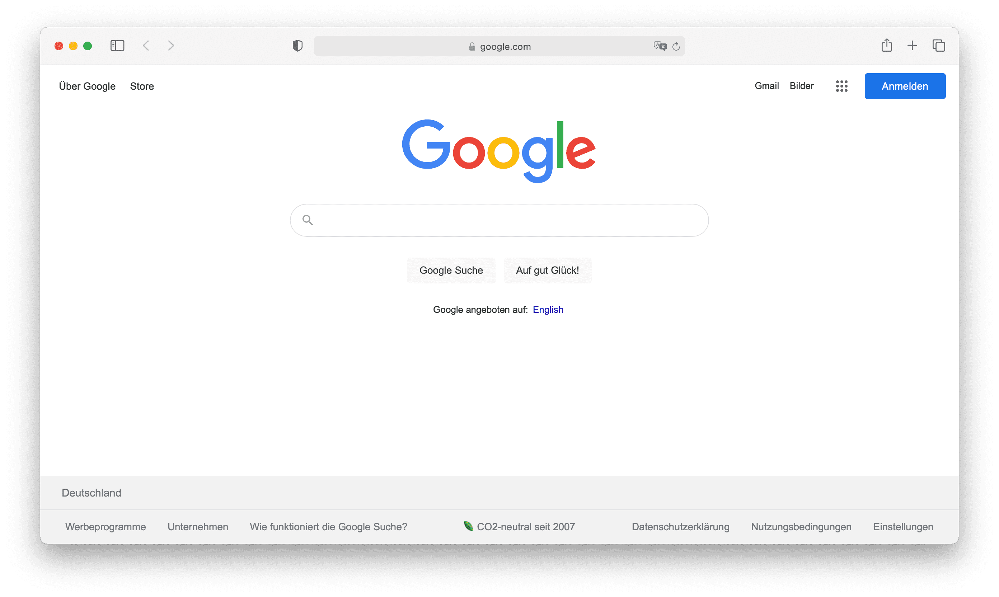
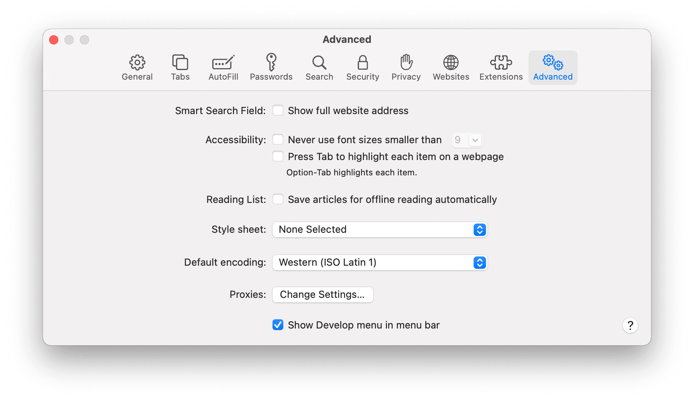
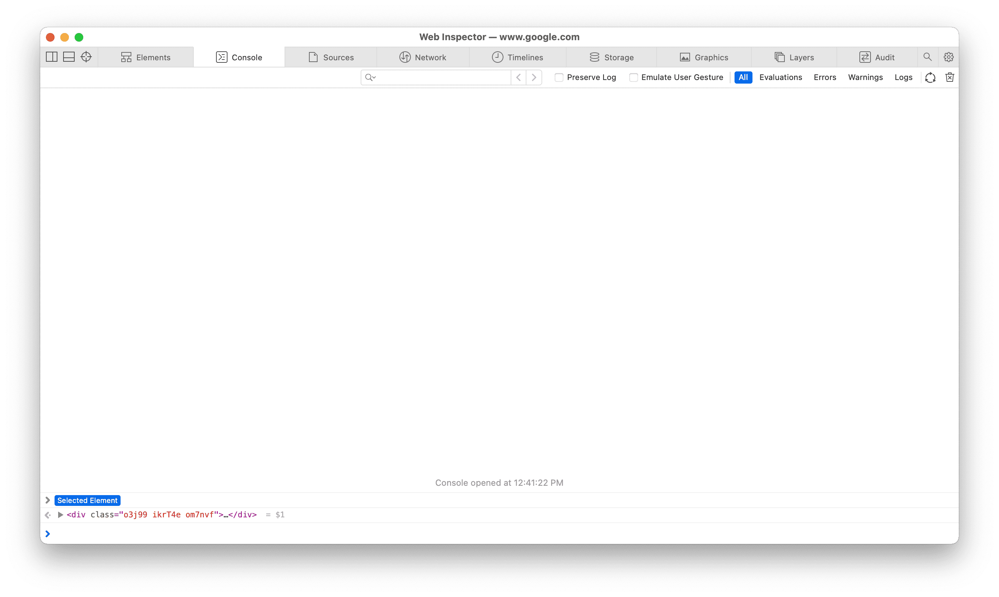
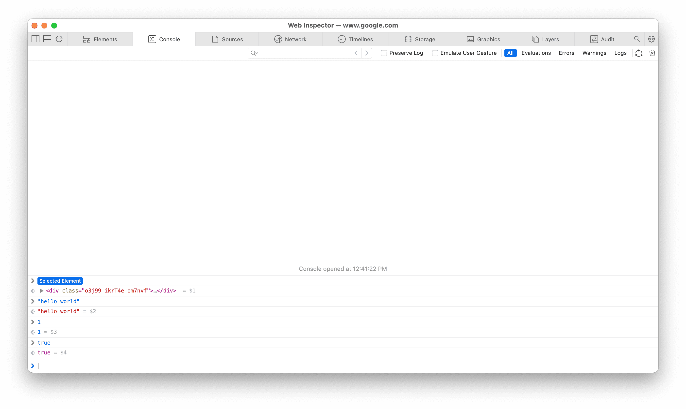

**Summary**

In order to execute JavaScript code, it will need an interpreter.
Interpreters are provided by host environments, e.g. web browsers and runtime environments.

Code can be executed interactively when written directly on the interpreter&mdash;
and on web browsers, through the _Browser Console_. On larger codebase,
they can be written to and executed from either an HTML file or a JavaScript file.

`video: https://www.youtube.com/embed/6U_485ypj1A`

**Table of Contents**

```toc

```

## Interpreters

- To execute JavaScript code, it requires an interpreter
- Interpreters are provided by web browsers and runtime environments

### Web browsers

Web browsers, e.g. Safari, provide client-side interpreters.

There are two ways to execute JavaScript code in web browsers:

1. Through the _Browser Console_
2. or through the HTML script tag

As an example, let's use Safari, the default web browser for macOS.

#### Browser Console

> The Browser Console executes written code interactively, i.e. the feedback is instant after submission.
> It is used primarily for debugging but is also commonly used to execute snippets of code.

1.  Open Safari

    

2.  First, enable _Develop menu_

    1.  Go to `Safari` > `Preferences...` > `Advanced`

    2.  then tick `Show Develop menu in menu bar`

        

3.  Open Console tab

    1.  Right click then select `Inspect Element` or press `command+option+i`

        

    2.  Select `Console` tab or press `command+option+c`

        

    3.  Write the code then press `enter` to submit

        

#### HTML script tag

> Code written in a file requires reloading the web browser after each save in order to see the changes.
> This is how JavaScript programs are normally written to maintain a larger codebase.

##### Within a script tag

1. Create an HTML file (e.g. `index.html`)

   ```shell
   $ touch index.html
   ```

2. Write the code inside `<script>`

   ```html
   <script>
     console.log("hello, world")
     console.log(1)
     console.log(true)
   </script>
   ```

   Then save the file.

   > **NOTES**
   >
   > - The `console` object provides access to Browser Console
   > - The `.log` method outputs a standard text to the console

3. Open the HTML file in a web browser

   ```shell
   $ open index.html
   ```

   Then see the result output on the _Browser Console_.

##### From a JavaScript file

1. Create a JavaScript file (e.g. `scripts.js`)

   ```shell
   $ touch scripts.js
   ```

2. Write the code in the JavaScript file

   ```javascript
   console.log("hello, world")
   console.log(1)
   console.log(true)
   ```

   Then save the file.

3. Create an HTML file (e.g. `index.html`)

   ```
   $ touch index.html
   ```

4. Link the JavaScript file

   ```html
   <script src="./scripts.js"></script>
   ```

5. Open the HTML file in a web browser

   ```shell
   $ open index.html
   ```

   Then see the result output on the _Browser Console_.

### Runtime environments

Runtime environments, e.g. Node.js, provide server-side interpreters.

There are also two ways to execute JavaScript code in runtime environments:

1. Through the REPL
2. Through a JavaScript file

As an example, let’s use Node.js, one of the host environments for JavaScript.

> Install Node.js via its official [installer](https://nodejs.org/en/download) or through [nvm](https://github.com/nvm-sh/nvm).

#### From the REPL

> The REPL is an interactive shell that can execute JavaScript code similar to Browser Console but without needing web browsers.

1. Open `node` interpreter

   ```shell
   $ node
   Welcome to Node.js v15.13.0.
   Type ".help" for more information.
   >
   ```

2. Write the code then press `enter` to submit

   ```shell
   Welcome to Node.js v15.13.0.
   Type ".help" for more information.
   > "hello, world"
   'hello, world'
   > 1
   1
   > true
   true
   ```

#### From a Javascript file

> Code written in a file requires that the file be re-executed after each save in order to see the changes.
> In similar fashion like in web browsers, this is how JavaScript programs are also written to maintain a larger codebase except that it is on the server-side.

1. Create a JavaScript file (e.g. `app.js`)

   ```shell
   $ touch app.js
   ```

2. Write the code in the JavaScript file

   ```javascript
   console.log("hello, world")
   console.log(1)
   console.log(true)
   ```

   Then save the file.

3. Execute the file

   ```shell
   $ node app.js
   hello, world
   1
   true
   ```
